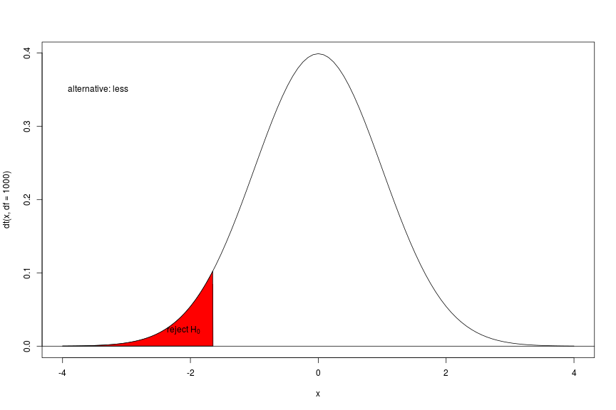

<style>
strong {
  font-weight: bold;
  color: red;
  font-size: 115%
}
</style>


--- .segue bg:grey

# News


--- 

## News


<iframe src="http://user2016.org/" width=100% height=100% allowtransparency="true"> </iframe>


--- &twocol w1:40% w2:60%

## News


*** =left

<iframe src="http://a2.typepad.com/6a0105360ba1c6970c01bb0885deea970d-pi" width=50% height=90% allowtransparency="true"> </iframe>

*** =right
Ross says that that observing the global labour of love has tempered his cynicism. 

<q2>R changed my opinion of humanity to some extent, to see how people are really willing to **freely give** of themselves and produce something larger than themselves **without** any thought of **personal glory**. There’s a **lot of work** with **no recognition.**</q2>


--- .segue bg:grey

# Recap


---

## Recap

You should know now:
>  - that statistics is all about simplifying 
>  - we try to summarize and describe data through parameters
     - location parameters (which? resp R commands?)
     - scale parameters/parameters of spread (which? resp R commands?)
 

--- 

## Recap

>- *mean()*, *median()*, *quantile()*
>- *sd()*, *range()*, *IQR()*


---


## Recap

We have seen how
>  - a difference of means (of two groups) 
>  - a spread parameter (standard deviation) and
>  - the sample sizea (as a parameter of uncertainty)

>  are combined to measure the difference of the location of two groups
>  this measure is compared to a null distribution through this comparison transformed in to a probability (p-value)


--- 

## test statistic

$$t = \frac{\bar{X}_{male} - \bar{X}_{female}}{s_{overall}\sqrt{\frac{1}{n_1} + \frac{1}{n_2}}}$$


--- 

## Two sided alternative


---

## One sided alternative - less



--- 

## One sided alternative - greater


--- .nobackground .quote 

<q>The p-value is the **probability** of the __sample estimate__ (of the respective estimator - here our *t*) __under the null__. We do not know anything of probabilities of the null or of estimates under the alternative!</q>


--- &vcenter &hcenter

## Decisions may be right - or wrong

|           | $H_0$ is true | $H_0$ is false|
|-----------|---------------|---------------|
|$H_0$ is not rejected| Correct decision|Type II error|
|$H_0$ is rejected| Type I error |  Correct decision|


--- .segue bg:grey

# T-tests in R

---

## T-tests in R

> - the one sample t-test
> - the two sample t-test assuming equal variances
> - the two sample t-test without the former assumption
> - the paired t-test (in fact: this is a one sample t-test against 0)
> - and there are others
> But: there is only one command in R: `t.test()`


---

## One Sample t-test


```r
set.seed(1)
x <- rnorm(12) ## create random numbers
t.test(x,mu=0) ## population mean 0
```

```
## 
## 	One Sample t-test
## 
## data:  x
## t = 1.1478, df = 11, p-value = 0.2754
## alternative hypothesis: true mean is not equal to 0
## 95 percent confidence interval:
##  -0.2464740  0.7837494
## sample estimates:
## mean of x 
## 0.2686377
```


---

## One Sample t-test


```r
t.test(x,mu=1) ## population mean 1
```

```
## 
## 	One Sample t-test
## 
## data:  x
## t = -3.125, df = 11, p-value = 0.009664
## alternative hypothesis: true mean is not equal to 1
## 95 percent confidence interval:
##  -0.2464740  0.7837494
## sample estimates:
## mean of x 
## 0.2686377
```


--- 

## Two Sample t-test

>  - we have given two numeric vectors
>  - we do not assume equal variance for the underlying distributions


```r
set.seed(1)
x <- rnorm(12) ## create random numbers
y <- rnorm(12) ## create random numbers
head(data.frame(x,y))
```

```
##            x           y
## 1 -0.6264538 -0.62124058
## 2  0.1836433 -2.21469989
## 3 -0.8356286  1.12493092
## 4  1.5952808 -0.04493361
## 5  0.3295078 -0.01619026
## 6 -0.8204684  0.94383621
```


--- 

## Two Sample t-test


```r
t.test(x,y)
```

```
## 
## 	Welch Two Sample t-test
## 
## data:  x and y
## t = 0.59393, df = 20.012, p-value = 0.5592
## alternative hypothesis: true difference in means is not equal to 0
## 95 percent confidence interval:
##  -0.5966988  1.0717822
## sample estimates:
##  mean of x  mean of y 
## 0.26863768 0.03109602
```


---

## Two Sample t-test

>  - we have one numeric vector and one vector containing the group information
>  - we do not assume equal variance for the underlying distributions


```r
g <- sample(c("A","B"),12,replace = T) ## create random group vector
head(data.frame(x,g))
```

```
##            x g
## 1 -0.6264538 B
## 2  0.1836433 B
## 3 -0.8356286 A
## 4  1.5952808 B
## 5  0.3295078 A
## 6 -0.8204684 A
```


---

## Two Sample t-test


```r
t.test(x~g)
```

```
## 
## 	Welch Two Sample t-test
## 
## data:  x by g
## t = -0.66442, df = 6.3524, p-value = 0.5298
## alternative hypothesis: true difference in means is not equal to 0
## 95 percent confidence interval:
##  -1.6136329  0.9171702
## sample estimates:
## mean in group A mean in group B 
##       0.1235413       0.4717726
```


---

## Two Sample t-test

  - we assume equal variance for the underlying distributions


```r
t.test(x,y,var.equal = T)
```

```
## 
## 	Two Sample t-test
## 
## data:  x and y
## t = 0.59393, df = 22, p-value = 0.5586
## alternative hypothesis: true difference in means is not equal to 0
## 95 percent confidence interval:
##  -0.5918964  1.0669797
## sample estimates:
##  mean of x  mean of y 
## 0.26863768 0.03109602
```


---

## When should you use a t-test

>  - comparison of mean values against a null-value or against each other
>  - the t-test, especially the Welch test is appropriate whenever the underlying distributions are normal
>  - it is also recommended for group sizes $\geq 30$ (robust against deviation from normality)


---

## Exercises

Use the ALLBUS data set:
- do a t-test of income (V417): male against female (V81)!
- and compare the bmi (V279) in smokers and non-smokers (V272) and between people with high and normal blood pressure (V242)
- how would you interpret the results?
- visualize!


--- .segue bg:grey

# Rolling the dice

---

## Rolling the dice

Suppose you are rolling a fair die 600 times: what is the number of 6s you are expecting?

And how many 6s do we need to reject the NULL (a fair die) using a two-sided test??


```r
qbinom(p = c(0.025,0.975),size = 600, prob = 1/6)
```

```
## [1]  82 118
```

What do we have to change for a one-sided test?


---

## Rolling the dice

Suppose you are rolling a fair die 600 times: what is the number of 6s you are expecting?

And how many 6s do we need to reject the NULL (a fair die) using a one-sided test on a 95% confidence level??

### Alternative: greater


```r
qbinom(p = 0.95,size = 600, prob = 1/6)
```

```
## [1] 115
```

### Alternative: less


```r
qbinom(p = 0.05,size = 600, prob = 1/6)
```

```
## [1] 85
```


---

## Rolling the dice

So now let R rolling the dice!


```r
sample(1:6,600,replace = T)
```

```
##   [1] 2 3 4 6 2 6 6 4 4 1 2 2 5 3 5 3 5 6 3 5 6 2 4 1 2 3 1 3 6 3 3 4 3 2 5
##  [36] 5 5 1 5 3 5 4 5 4 4 5 1 3 5 5 3 6 3 2 1 1 2 4 4 3 6 2 3 2 4 2 3 5 1 6
##  [71] 3 6 3 3 3 6 6 3 5 6 3 5 3 2 5 2 5 1 2 1 2 1 4 6 5 5 3 3 5 4 4 3 2 6 4
## [106] 2 1 3 6 4 6 5 3 3 1 1 5 1 3 4 6 3 3 2 5 3 4 2 2 4 4 1 1 4 6 4 4 4 6 4
## [141] 5 4 2 2 5 3 2 5 1 6 4 4 2 3 4 2 4 1 2 2 2 6 3 5 6 3 1 3 5 3 4 6 6 3 3
## [176] 6 4 5 4 6 2 2 6 4 6 2 5 5 6 4 5 3 1 6 2 4 1 6 2 5 2 2 4 2 2 4 4 1 2 5
## [211] 6 1 5 6 5 2 4 6 6 3 2 1 2 4 6 4 2 1 3 6 3 1 3 4 3 5 5 4 3 3 2 4 6 1 3
## [246] 2 3 1 3 6 5 6 3 4 3 1 2 3 3 6 4 2 2 5 5 1 1 5 4 2 1 1 3 2 2 2 2 2 3 5
## [281] 1 4 6 3 1 1 2 1 1 2 2 1 6 2 4 5 1 1 1 6 5 1 3 3 3 6 2 5 1 3 1 2 6 5 2
## [316] 3 1 3 6 4 4 2 3 6 6 6 5 5 2 5 6 2 3 5 1 3 3 1 4 6 6 2 4 3 5 2 3 2 3 5
## [351] 3 1 5 3 6 2 6 1 6 3 1 2 6 2 4 6 1 5 5 3 3 4 6 2 2 3 3 6 2 3 3 4 4 6 2
## [386] 2 5 5 1 6 1 1 6 4 1 3 4 2 3 1 4 2 6 6 6 5 3 5 1 6 6 3 5 5 5 3 3 2 5 5
## [421] 3 4 4 1 3 3 1 6 6 6 6 1 3 4 1 5 5 1 3 6 1 2 4 4 2 3 3 6 1 1 6 3 3 2 1
## [456] 4 4 6 4 1 1 3 1 3 2 6 5 1 3 5 3 6 5 3 1 2 6 3 3 5 5 1 6 6 4 4 2 1 6 1
## [491] 1 6 2 1 3 3 3 4 6 1 4 5 4 4 3 6 3 6 5 4 6 3 1 5 5 2 4 4 3 4 5 5 3 1 3
## [526] 6 5 5 6 6 4 1 3 2 1 1 3 3 2 4 3 6 4 2 2 1 6 3 4 5 6 4 1 6 5 3 1 1 5 5
## [561] 4 1 3 5 6 5 2 4 2 6 1 3 2 1 5 4 5 3 6 5 3 6 4 1 4 3 1 4 6 5 4 2 5 4 5
## [596] 4 3 3 3 3
```


---

## Rolling the dice

Count the 6s!


```r
sample(1:6,600,replace = T)==6
```

```
##   [1] FALSE FALSE FALSE  TRUE FALSE  TRUE  TRUE FALSE FALSE FALSE FALSE
##  [12] FALSE FALSE FALSE FALSE FALSE FALSE  TRUE FALSE FALSE  TRUE FALSE
##  [23] FALSE FALSE FALSE FALSE FALSE FALSE  TRUE FALSE FALSE FALSE FALSE
##  [34] FALSE FALSE FALSE FALSE FALSE FALSE FALSE FALSE FALSE FALSE FALSE
##  [45] FALSE FALSE FALSE FALSE FALSE FALSE FALSE  TRUE FALSE FALSE FALSE
##  [56] FALSE FALSE FALSE FALSE FALSE  TRUE FALSE FALSE FALSE FALSE FALSE
##  [67] FALSE FALSE FALSE  TRUE FALSE  TRUE FALSE FALSE FALSE  TRUE  TRUE
##  [78] FALSE FALSE  TRUE FALSE FALSE FALSE FALSE FALSE FALSE FALSE FALSE
##  [89] FALSE FALSE FALSE FALSE FALSE  TRUE FALSE FALSE FALSE FALSE FALSE
## [100] FALSE FALSE FALSE FALSE  TRUE FALSE FALSE FALSE FALSE  TRUE FALSE
## [111]  TRUE FALSE FALSE FALSE FALSE FALSE FALSE FALSE FALSE FALSE  TRUE
## [122] FALSE FALSE FALSE FALSE FALSE FALSE FALSE FALSE FALSE FALSE FALSE
## [133] FALSE FALSE  TRUE FALSE FALSE FALSE  TRUE FALSE FALSE FALSE FALSE
## [144] FALSE FALSE FALSE FALSE FALSE FALSE  TRUE FALSE FALSE FALSE FALSE
## [155] FALSE FALSE FALSE FALSE FALSE FALSE FALSE  TRUE FALSE FALSE  TRUE
## [166] FALSE FALSE FALSE FALSE FALSE FALSE  TRUE  TRUE FALSE FALSE  TRUE
## [177] FALSE FALSE FALSE  TRUE FALSE FALSE  TRUE FALSE  TRUE FALSE FALSE
## [188] FALSE  TRUE FALSE FALSE FALSE FALSE  TRUE FALSE FALSE FALSE  TRUE
## [199] FALSE FALSE FALSE FALSE FALSE FALSE FALSE FALSE FALSE FALSE FALSE
## [210] FALSE  TRUE FALSE FALSE  TRUE FALSE FALSE FALSE  TRUE  TRUE FALSE
## [221] FALSE FALSE FALSE FALSE  TRUE FALSE FALSE FALSE FALSE  TRUE FALSE
## [232] FALSE FALSE FALSE FALSE FALSE FALSE FALSE FALSE FALSE FALSE FALSE
## [243]  TRUE FALSE FALSE FALSE FALSE FALSE FALSE  TRUE FALSE  TRUE FALSE
## [254] FALSE FALSE FALSE FALSE FALSE FALSE  TRUE FALSE FALSE FALSE FALSE
## [265] FALSE FALSE FALSE FALSE FALSE FALSE FALSE FALSE FALSE FALSE FALSE
## [276] FALSE FALSE FALSE FALSE FALSE FALSE FALSE  TRUE FALSE FALSE FALSE
## [287] FALSE FALSE FALSE FALSE FALSE FALSE  TRUE FALSE FALSE FALSE FALSE
## [298] FALSE FALSE  TRUE FALSE FALSE FALSE FALSE FALSE  TRUE FALSE FALSE
## [309] FALSE FALSE FALSE FALSE  TRUE FALSE FALSE FALSE FALSE FALSE  TRUE
## [320] FALSE FALSE FALSE FALSE  TRUE  TRUE  TRUE FALSE FALSE FALSE FALSE
## [331]  TRUE FALSE FALSE FALSE FALSE FALSE FALSE FALSE FALSE  TRUE  TRUE
## [342] FALSE FALSE FALSE FALSE FALSE FALSE FALSE FALSE FALSE FALSE FALSE
## [353] FALSE FALSE  TRUE FALSE  TRUE FALSE  TRUE FALSE FALSE FALSE  TRUE
## [364] FALSE FALSE  TRUE FALSE FALSE FALSE FALSE FALSE FALSE  TRUE FALSE
## [375] FALSE FALSE FALSE  TRUE FALSE FALSE FALSE FALSE FALSE  TRUE FALSE
## [386] FALSE FALSE FALSE FALSE  TRUE FALSE FALSE  TRUE FALSE FALSE FALSE
## [397] FALSE FALSE FALSE FALSE FALSE FALSE  TRUE  TRUE  TRUE FALSE FALSE
## [408] FALSE FALSE  TRUE  TRUE FALSE FALSE FALSE FALSE FALSE FALSE FALSE
## [419] FALSE FALSE FALSE FALSE FALSE FALSE FALSE FALSE FALSE  TRUE  TRUE
## [430]  TRUE  TRUE FALSE FALSE FALSE FALSE FALSE FALSE FALSE FALSE  TRUE
## [441] FALSE FALSE FALSE FALSE FALSE FALSE FALSE  TRUE FALSE FALSE  TRUE
## [452] FALSE FALSE FALSE FALSE FALSE FALSE  TRUE FALSE FALSE FALSE FALSE
## [463] FALSE FALSE FALSE  TRUE FALSE FALSE FALSE FALSE FALSE  TRUE FALSE
## [474] FALSE FALSE FALSE  TRUE FALSE FALSE FALSE FALSE FALSE  TRUE  TRUE
## [485] FALSE FALSE FALSE FALSE  TRUE FALSE FALSE  TRUE FALSE FALSE FALSE
## [496] FALSE FALSE FALSE  TRUE FALSE FALSE FALSE FALSE FALSE FALSE  TRUE
## [507] FALSE  TRUE FALSE FALSE  TRUE FALSE FALSE FALSE FALSE FALSE FALSE
## [518] FALSE FALSE FALSE FALSE FALSE FALSE FALSE FALSE  TRUE FALSE FALSE
## [529]  TRUE  TRUE FALSE FALSE FALSE FALSE FALSE FALSE FALSE FALSE FALSE
## [540] FALSE FALSE  TRUE FALSE FALSE FALSE FALSE  TRUE FALSE FALSE FALSE
## [551]  TRUE FALSE FALSE  TRUE FALSE FALSE FALSE FALSE FALSE FALSE FALSE
## [562] FALSE FALSE FALSE  TRUE FALSE FALSE FALSE FALSE  TRUE FALSE FALSE
## [573] FALSE FALSE FALSE FALSE FALSE FALSE  TRUE FALSE FALSE  TRUE FALSE
## [584] FALSE FALSE FALSE FALSE FALSE  TRUE FALSE FALSE FALSE FALSE FALSE
## [595] FALSE FALSE FALSE FALSE FALSE FALSE
```


---

## Rolling the dice

Count the 6s!


```r
sum(sample(1:6,600,replace = T)==6)
```

```
## [1] 100
```


---

## Exercise

Now use the following code to replicate the experiment (rolling one fair dice 600 times) 1000 times. The number of 6s are stored in the vector `x`.

How many statistically significant results do you expect for a one-sided alternative? How many for a two-sided alternative?

How many statistically significant results did you get? (you can use `table()` in combination with a logical function)

Visualize the result using ggplot2 and `geom_histogram()` (look at the help of `geom_histogram` )! 


```r
x <- replicate(1000, sum(sample(1:6,600,replace = T)==6))
df <- data.frame(repid = 1:1000, n.6s = x)
```


---

## Exercise


```r
head(df,10)
```

```
##    repid n.6s
## 1      1   98
## 2      2  110
## 3      3   92
## 4      4  103
## 5      5  115
## 6      6  105
## 7      7  108
## 8      8  107
## 9      9  105
## 10    10  118
```
